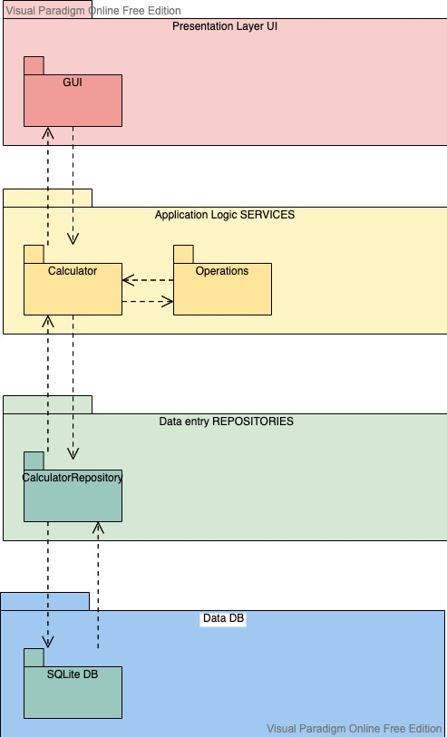

# Arkkitehtuurikuvaus

## Rakenne

Ohjelman rakenne noudattelee kolmitasoista kerrosarkkitehtuuria, ja koodin pakkausrakenne on seuraava:

Pakkaukset: _ui_ sisältää käyttöliittymästä, _services_ sovelluslogiikasta ja _repositories_ tietojen pysyväistallennuksesta vastaavan koodin. 

## Käyttöliittymä

Ohjelmalla ei ole erikseen käyttäjiä.
Graafinen käyttöliittymä sisältää yksinkertaisen näkymän:

Laskin, jossa näyttö:
- numeronäppäimet
- näppäimet toiminnallisuuksille +, -, =, etc.
- näppäin STAT tulostaa terminaaliin tilaston.

Myös terminaali toimii osana käyttöliittymää, koska tietokannan haut tulostuvat terminaaliin.

Näkymien näyttämisestä vastaa [GUI](../src/ui/gui.py)-luokka. Käyttöliittymä on pyritty eristämään sovelluslogiikasta. 

GUI ainoastaan kutsuu [Calculator](../src/services/calculator.py)-luokan metodeja, joka edelleen kutsuu [Operations](../src/services/operations.py) luokan metodeja.

## Sovelluslogiikka

Toiminnallisuudesta vastaa luokka [Calculator](../src/services/calculator.py). Luokka kutsuu erillisen luokan [Operations](../src/services/operations.py)  metodeja, joilla laskimen toiminnallisuus syntyy.

Calculator tallentaa ja pääsee käsiksi suoritettujen operaatioiden tilastoihin tallennuksesta vastaavan pakkauksessa _repositories_ sijaitsevan luokan [CalculatorRepository](../src/repositories/calculator_repository.py) kautta. 

## Tietojen pysyväistallennus

Pakkauksen _repositories_ luokka `CalculatorRepository` huolehtii tietojen tallettamisesta käyttämällä SQLite -tietokantaa. 

### Tiedostot

Tilastodata tehdyistä laskutoimituksista tallennetaan SQLite-tietokannan tauluun `operations`, joka alustetaan [initialize_database.py](../src/initialize_database.py)-tiedostossa.

## Päätoiminnallisuudet

Kuvataan seuraavaksi sovelluksen toimintalogiikka muutaman päätoiminnallisuuden osalta sekvenssikaaviona.

### Laskuoperaatioiden suorittaminen

- [ ]Tänne joku sekvenssikaavio

## Ohjelman rakenteeseen jääneet heikkoudet

### Käyttöliittymä

